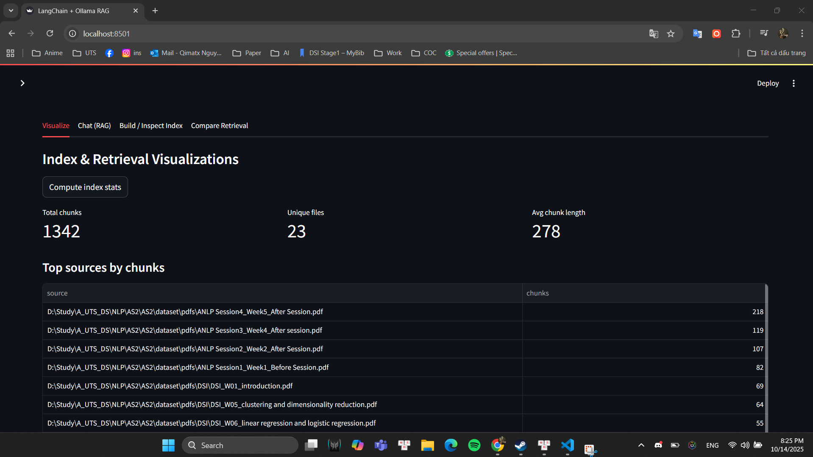

# LangChain + Ollama + Streamlit RAG App


This project is a **local Retrieval-Augmented Generation (RAG) system** that allows you to **chat with your own PDF documents** through a beautiful **Streamlit web interface** — fully offline and privacy-friendly.  
It uses **Ollama** to run open-source Large Language Models (LLMs) such as **Llama 3.1:8B** and **nomic-embed-text** locally, without any API key or cost.

---

## Features

- **Conversational Q&A:** Ask questions directly about your uploaded or pre-indexed PDFs.  
- **Source References:** Each answer includes references to document names and page numbers.  
- **Conversational Memory:** Follow-up questions maintain context naturally.  
- **Completely Local:** No external API calls — your data stays 100% on your device.  
- **Easy Index Management:** Build, inspect, or append PDFs to a persistent FAISS vector store.  
- **Retriever Comparison:** Compare basic retriever vs. Multi-Query Retriever for deeper search.

---

## Architecture Overview

The system follows a **RAG (Retrieval-Augmented Generation)** pipeline:

1. **Load & Split PDFs:** All PDFs inside `/Dataset/pdfs` are loaded and chunked using `RecursiveCharacterTextSplitter`.  
2. **Embed & Index:** `nomic-embed-text` converts each text chunk into embeddings, stored in a FAISS vector index.  
3. **Retrieve:** When you ask a question, the system retrieves the most semantically relevant chunks.  
4. **Generate:** `llama3.1` uses LangChain’s context-aware chain to produce grounded answers.  
5. **Compare:** Multi-Query retriever expands the question to test retrieval diversity.

---

## Tech Stack

| Component | Description |
|------------|-------------|
| **Ollama** | Local LLM runtime for Llama 3.1 and Embedding models |
| **LangChain** | RAG orchestration, document loaders, retrievers |
| **Streamlit** | Web interface for chat, upload, and index management |
| **FAISS** | Vector store for fast semantic search |
| **Docker Compose** | One-command setup for all services |

---
1.  **Install Docker and Docker Compose:**
    *   Go to the official website: [https://www.docker.com/products/docker-desktop/](https://www.docker.com/products/docker-desktop/)
    *   Download and install **Docker Desktop** for your operating system (Windows, macOS, or Linux).
    *   After installation, make sure Docker is running in the background.
    *   Check installation:
        ```bash
        docker --version
        docker compose version
        ```

2.  **Build and run the Docker container:**
    *   Open your terminal in the project directory (where the `Dockerfile` and `docker-compose.yml` files are located).
    *   Build and start the container (in detached mode) with a single command:
        ```bash
        docker compose up -d --build
        ```
    *   This command will:
        - Build the Docker image (installing all dependencies from `requirements.txt`)
        - Start the container in the background
        - Expose the app on the port defined in `docker-compose.yml` (usually `localhost:8501`)

3.  **Access the application:**
    *   Once the container is running, open your browser and go to:
        ```bash
        http://localhost:8501
        ```
    *   (Or the port you set in your Docker configuration.)

4.  **Stop the container:**
    *   When finished, stop all running containers:
        ```bash
        docker compose down
        ```

5.  **Rebuild after code or dependency changes :**
    *   If you update your code or `requirements.txt`, rebuild before running again:
        ```bash
        docker compose build
        docker compose up -d
        ```
6.  **Rebuild after code or function changes (optional):**
    *   If you update your code or `requirements.txt`, rebuild before running again:
        ```bash
        docker compose up -d --build      
         ```
    *   If you update your function only , rebuild before running again:
        ```bash
        docker compose up -d --build app   
        ```
* => After confirming the app runs correctly (containers healthy, Streamlit reachable at (http://localhost:8501)).
7. **Push lastest code changes to GitHub:**
    * Check before update 
        ```bash
        git stash
        git pull origin main --rebase
        git stash pop
        ```
        
    * Run these commands from the project root:
        ```bash
        git add .
        git commit -m " Update......"
        git push origin main
        ```
    * If you are working on a new branch (recommended for feature updates):

        ```bash
        git checkout -b feature/test
        git push -u origin feature/test
        ```
    * Then open your GitHub repository → create a **Pull Request** → review and merge into `main`.
    * Once merged, your updated Streamlit RAG project and Compare Retrieval feature are now versioned and ready for evaluation.
---

**Notes:**

* The container automatically installs packages from `requirements.txt`.
* After the first build, if you only update functions, using command 6 will be faster.
* Make sure Ollama models (like `llama3` and `nomic-embed-text`) are already downloaded and running locally before starting the app.
* If Ollama is running outside Docker, ensure the ports are correctly mapped in `docker-compose.yml`.


